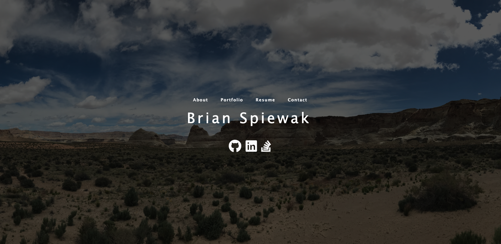
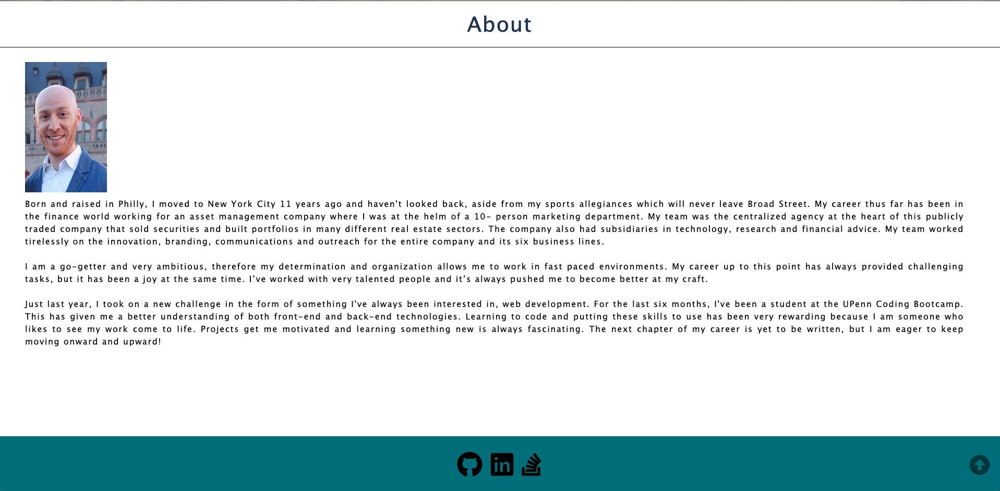
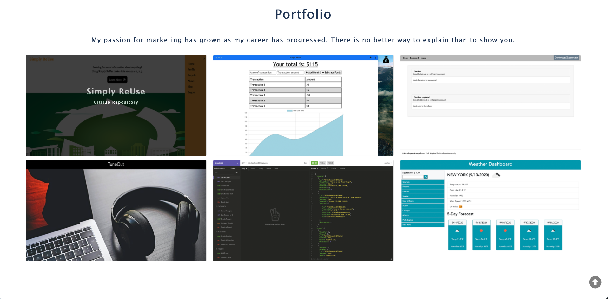
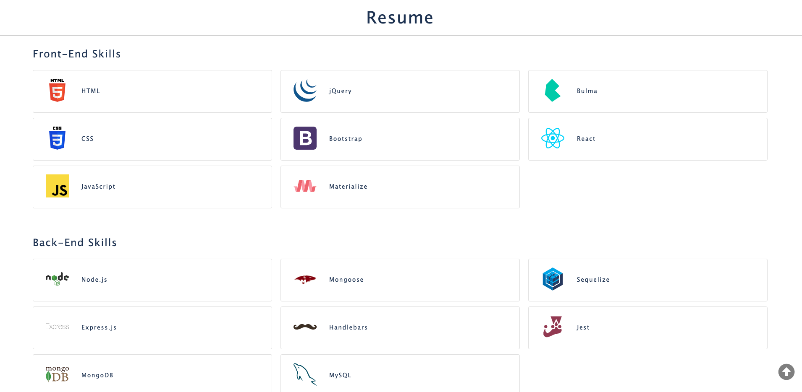
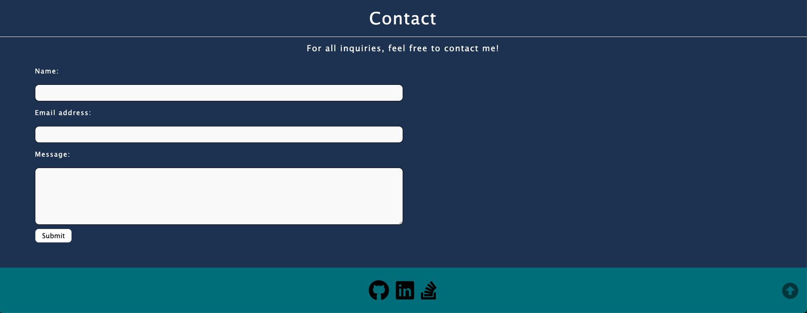

# Portfolio Built with React

## Description
After completing five months of the UPenn Coding Bootcamp, this assignment was to update my portfolio to show off the work that I've accomplished thus far in class. This single-page application is built using React with a mobile-first design. 

## Table of Contents
* [Technologies](#technologies)
* [Screenshots](#screenshots)
* [Requirements](#requirements)
* [Links](#links)

## Technologies
  

  
  
   
  

## Screenshots
#### Homepage
  
#### About
  
#### Portfolio
  
#### Resume
  
#### Contact

## Requirements
1. When the user visits the homepage for the first time, they are shown my name and a navigation with About, Portfolio, Resume and Contact
2. There is a brief bio about me included on the About section
3. When the user visits the Portfolio, they can see a selection of my work that I have done throughout class including two group projects which are Simply ReUse and TuneOut
4. The Resume page includes my skills I have learned and a link to my resume
5. Lastly, there is a contact form on the contact page 
    * This form's functionality will be installed in the future so for now, please email me at bspiewak6@gmail.com with any questions.

## Links
* [React Portfolio Deployed App](https://bspiewak6.github.io/portfolio-react/)
* [React Portfolio Repository](https://github.com/bspiewak6/portfolio-react)